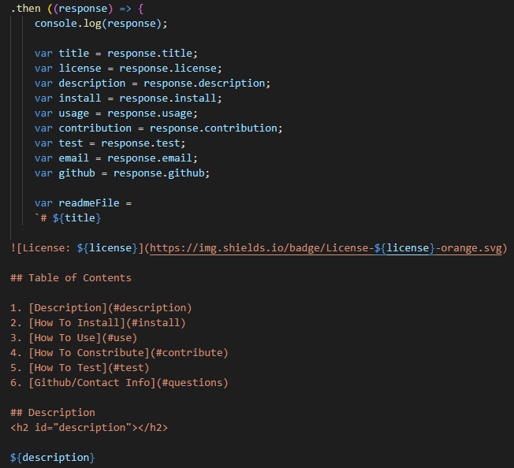

# readmeGenerator
   

## Table of Contents

1. [Description](#description)
2. [How To Install](#install)
3. [How To Use](#use)
4. [Built With](#built)
5. [Code Snippet](#snippet)
6. [Author](#author)

## Description 
<h2 id="description"></h2> 

The goal of this project is to generate a high quality README.md after the user has entered information about their application in the terminal.

## How To Install
<h2 id="install"></h2> 

Clone down this repository to a folder in your system.

## How To Use
<h2 id="use"></h2> 

1. Open up your terminal, and navigate to the location of this file. 
2. In your terminal, type 'node index.js' to run the file.
3. Enter the information asked for.

## Built With
<h2 id="built"></h2> 

* [JavaScript]
* [Github]
* [GitBash]
* [NodeJS]
* [Inquirer]

## Code Snippet
<h2 id="snippet"></h2> 

## Authors
<h2 id="author"></h2> 

**Manuel** 

[Link to Github](https://github.com/manuelvrsr)

[Link to LinkedIn](https://www.linkedin.com/in/manuel-villasenor-854186205/)

  